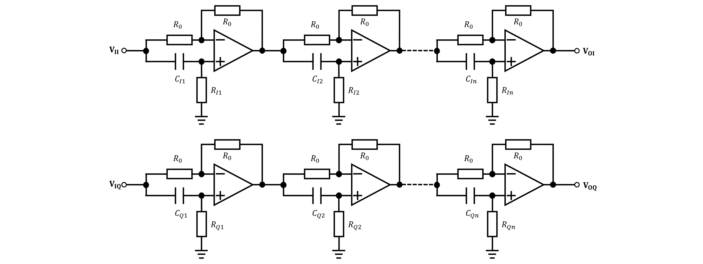
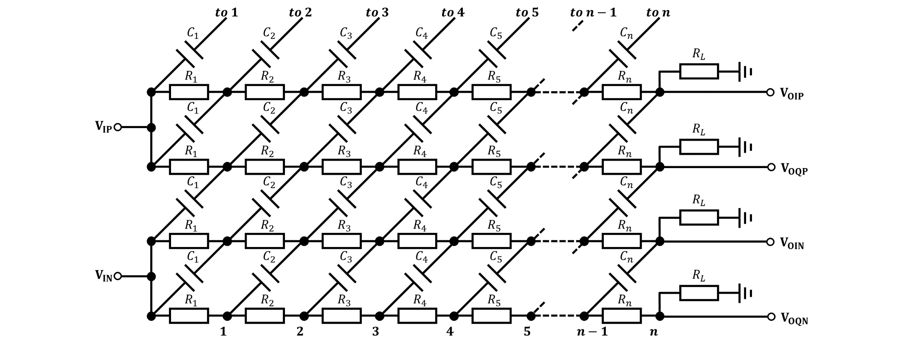
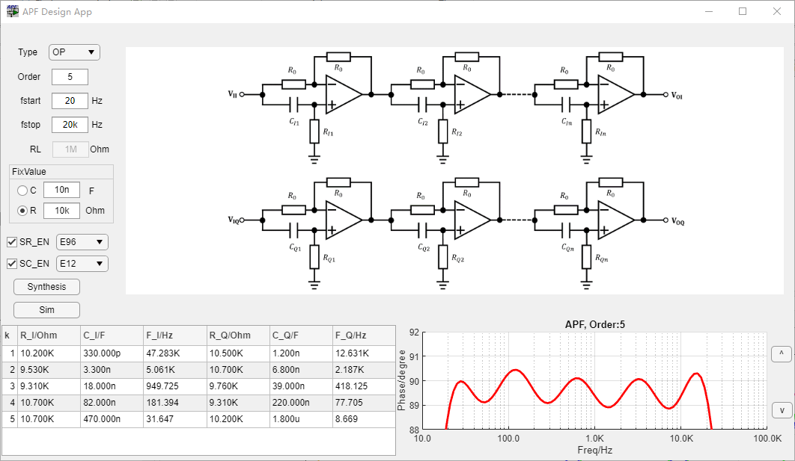
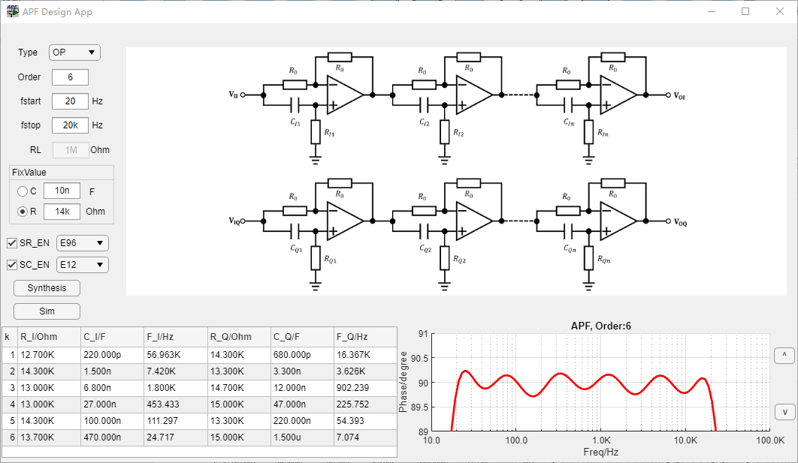
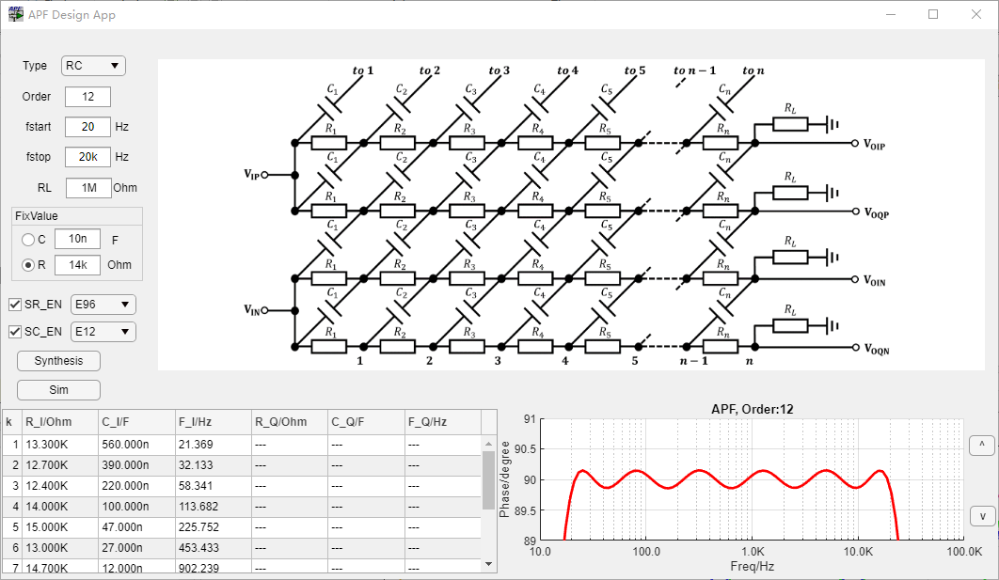

# APFDesign
 All Pass Filter Design using matlab

## 概述
本设计工具支持两种不同的全通滤波器(APF,All Pass Filter)/多相网络(PN, Polyphase Network)所构成的移相网络(Phase-Shift Network)设计，一种是运放构成的移相网络(APF)，一种是由RC构成的多相网络(PN)。

由运放构成的移相网络设计非常简单，由于运放可以将输入和输出级进行隔离，只要计算出极点位置，就可以直接进行电路综合了。

使用纯RC设计的多项网络，电路非常经济，并且可以工作在高速下，电路的发明人就是在设计单边带收发机中设计了这种多相网络，这种网络有着非常有趣的性质，它实际上是一个恒定输入阻抗的网络，所以这种网络同前面运放网络一样，前后级之间极点并不会相互影响，综合起来非常简单。并且这种网络可以扩展为任意等相位的设计，比如8相位，16相位等等。

为了设计参数统一，这里的阶数n实际上是级数n。

## 设计公式

设级数为$n$，输入最低频率为$f_l$，输入最高频率为$f_h$。

### 运放APF
对于最基本的全通网络单元，可以得到其传递函数为：
$$\begin{align}
H(s)=\dfrac{sR_1C_1-1}{sR_1C_1+1} \tag{1}
\end{align}$$
可以得到幅度和相位分别为：
$$\begin{align}
|H(w)|&=1 \tag{2} \\
\phi(w)&= -2\tan^{-1}{wR_1C_1}\tag{3}
\end{align}$$
对于相位关系也可以写成如下形式：
$$\begin{align}
\tan \frac{\phi(w)}{2}= -wR_1C_1 \tag{4}
\end{align}$$
这个表达式说明了其可以直接用[宽带分相网络设计](https://mp.weixin.qq.com/s/QWwqPndbAh_BrI7GuakYNw)中的切比雪夫逼近来计算，公式为：
$$\begin{align}
P(w) = if_l \operatorname{sn}\left(i\dfrac{4m+1}{2n}\dfrac{K(k')}{K(k)},k\right) \tag{5}
\end{align}$$

### 多相网络PN
多相网络通过[宽带分相网络设计](https://mp.weixin.qq.com/s/QWwqPndbAh_BrI7GuakYNw)可以得到：
$$\begin{align}
P(w) &= \dfrac{f_l}{{\operatorname{dn}}\left(\dfrac{2m-1}{2n}K(k),k\right)} \tag{6} \\
k&=\sqrt{1-{\dfrac{f_l}{f_u}}^2} \tag{7}
\end{align}$$
上式中的$m=0,1,2,...,n$。

## 设计举例
设计一个移相网络，要求输入频率范围20Hz至20kHz，相位误差$\pm 1^{\circ}$：

最终设计如下：

可以看到电阻使用E96系列，电容使用E12系列，5级运放即可以满足设计要求，当然如果可以设计成可调的，带内纹波可以非常小。

通过实验，6级可以得到更好的值：

当然如果使用纯RC多相网络，可以得到更加好的结果，这也很容易理解，两个相邻的移相网络的器件差异并不会导致最终相位有多大改变，关键是四个电阻和四个电容之间的匹配是最关键的，所以这种移相网络特别适合在IC中实现：

## 参考
[1] :  \
